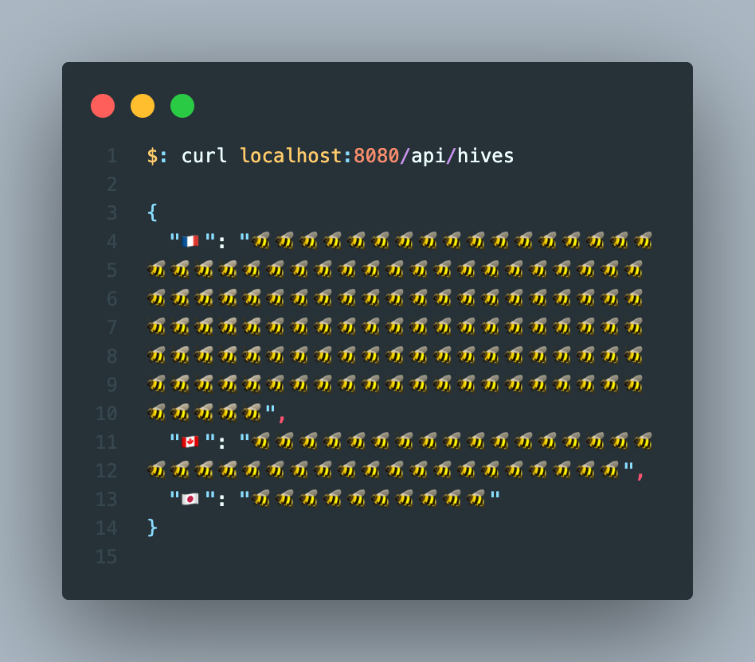

# Deploy your side project in 10 minutes with Fly.io

> In this post, IP will aim on giving your the keys to **deploy quickly** your API online using Fly.io platform.

First, what is Fly.io ? Like classic cloud platform as AWS/GCP/Azure, Fly.io enables you to deploy your application/api/microservices/database on the cloud. But unlike these, it stands out for its simplicity.

You can deploy a lot of different technologies such as Laravel/Python/Deno/Node/Go etc threw automatic templates or even use a Dockerfile. It's really easy to use thanks to the CLI tools and documentation provided. This enables you to deploy and scale your app worldwide close to your users without worrying about network, DNS or security. It also provides lots of metrics about your app with an integrated Graphana accessible on your dashboard. With the free tier, you can host 2 projects.

👉 To have more details about those features just check their [website](https://fly.io)

In this article, I will deploy a simple Node.js server written in Typescript, **focusing only on the steps necessary for deployment**. For more information feel free to consult their documentation.

## Prerequisites

Have a [Node](https://nodejs.org/en/) environment installed and [Docker](https://www.docker.com) if you want to test your build locally.

👉 Install [fly cli tools](https://fly.io/docs/hands-on/install-flyctl/) 👇
 
>*Flyctl is a command-line utility that lets you work with the Fly.io platform, from creating your account to deploying your applications.*

```bash
$: brew install flyctl

🐧$: curl -L https://fly.io/install.sh | sh

🪟$: iwr https://fly.io/install.ps1 -useb | iex
```

## Create our app

*You can clone this project on [Github](https://github.com/corentinleberre/beekeeper) or copy the code below 👇*

📦 Structure of the project

```
📦beekeeper
 ┣ 📂src
 ┃ ┗ 📜main.ts
 ┣ 📜Dockerfile
 ┣ 📜fly.toml
 ┣ 📜package-lock.json
 ┣ 📜package.json
 ┗ 📜tsconfig.json
```

### Part 1 : Create the Node.JS API

👉 Init a npm project 

```bash
$: npm init
```

👉 Add this configuration in **package.json**

```json
{
  /***/
  "type": "module",
  "scripts": {
    "dev": "ts-node src/main.ts",
    "build": "rm -rf dist && tsc --build",
    "start": "node dist/src/main.js"
  }
  /***/
}
```

👉 Install dependencies

```bash
$: npm install express
$: npm install -D typescript ts-node @types/node @types/express
```

👉 Configure Typescript compiler in **tsconfig.json**

```json
{
    "compilerOptions": {
        "module": "ESNext",
        "moduleResolution": "Node",
        "esModuleInterop": true,
        "rootDir": "./src",
        "outDir": "./dist/src",
    },
    "ts-node": {
        "esm": true
    }
}
```

👉 Create the express api in **src/main.ts**. It's a simple server made for a beekeeper that allows him to know the state of his hives. It exposes a single access point via **/api/hives**.

```typescript
import express from "express";
import { Express, Request, Response } from "express";

const app: Express = express();
const port = process.env.PORT || 8080;

const bees = (n: number): string => Array(n).fill("🐝").join("");

const getHives = (req: Request, res: Response): void => {
  const hives = {
    "🇫🇷": bees(150),
    "🇨🇦": bees(40),
    "🇯🇵": bees(10),
  };
  res.status(200).json(hives);
};

app.get("/api/hives", getHives);

app.listen(port, () =>
  console.log(`🍯 Beekeeper is running on http://localhost:${port}`)
);
```

You can now run the app with **npm run dev**

### Part 2 : Build the app with Docker

*⚠️ Your Docker Daemon need to be working to execute these commands*

👉 Build the image locally

```bash
$: docker build -t beekeeper .
```

👉 Verify if the image has been correctly created

```bash
$: docker images | grep beekeeper
beekeeper    latest    2dc2439eaec3   1 min ago      118MB
```

👉 Test the server locally

```bash
$: docker run -it -p 8080:8080 beekeeper
```
You should get the state of the Hives when fetching your local endpoint



### Part 3 : Deploy the app

👉 Log-in or create your Fly.io account

```bash
$: flyctl auth login
$: flyctl auth signup
```

👉 Use the cli to the app and follow the steps below 👇

```bash
$: flyctl launch
```

- Answer **no** to .dockerignore
- Define the app name to the name of your project
- Deploy the app in the region of your choice. You can add more or change it later
- Answer **no** to Postgresql and Redis database
- Answer **yes** to deploy now

It may take 1 or 2 minutes to create your project and build your Docker image with Fly remote builders *(optional)*. If it succeed, you should see this in your terminal 👇

```term
--> Building image done
==> Pushing image to fly
The push refers to repository [registry.fly.io/beekeeper]
deployment-01GJY6F3Y3707JXJ7PTZQKFS57: digest: sha256:722fe804f091c9fd33b789ac9c06ae68af87d1e6c6720025bdb33da0bf13fe1d size: 1991
--> Pushing image done
image: registry.fly.io/beekeeper:deployment-01GJY6F3Y3707JXJ7PTZQKFS57
image size: 118 MB
==> Creating release
--> release v1 created

--> You can detach the terminal anytime without stopping the deployment
==> Monitoring deployment

 1 desired, 1 placed, 0 healthy, 1 unhealthy [health checks: 1 total, 1 critical]
Failed Instances
```

You can detach the terminal now. You can check the status of your app later with **flyctl status**.

Your app is now online ! Lets try to access it.

* Go to your [dashboard](https://fly.io/dashboard) and click on the app you created.
* You should see a lot of information about your app including the bandwidth and cpu/ram used.
* You should find your app url in the "**Hostname**" box. Click on it and add **/api/hives** at the end. 

Tadaam, you should see lots of bees, your app is deployed 🥳 !

To redeploy the app after a change in your code/conf use **fly deploy**.

### Conclusion

I hope you learned some new stuff in this post. I focused on a simple case and the mandatory steps to deploy our application. If you need more information, feel free to check out the bonus section or the fly.io documentation.

## Bonus

### Configurations

The CLI tools generate for you **fly.toml** a configuration file used to describe your app on their platform. Here you can define ports, env variables, deploy and runtime options, the protocol used, etc. [More info here](https://fly.io/docs/reference/configuration/).

Example of fly.toml generated for this project 👇

```toml
# fly.toml file generated for beekeeper

app = "beekeeper"
kill_signal = "SIGINT"
kill_timeout = 5
processes = []

[env]
  PORT=8080

[experimental]
  allowed_public_ports = []
  auto_rollback = true

[[services]]
  http_checks = []
  internal_port = 8080
  processes = ["app"]
  protocol = "tcp"
  script_checks = []
  [services.concurrency]
    hard_limit = 25
    soft_limit = 20
    type = "connections"

  [[services.ports]]
    force_https = true
    handlers = ["http"]
    port = 80

  [[services.ports]]
    handlers = ["tls", "http"]
    port = 443

  [[services.tcp_checks]]
    grace_period = "1s"
    interval = "15s"
    restart_limit = 0
    timeout = "2s"
```

### Regions

You can currently deploy your apps in [26 differents regions](https://fly.io/docs/reference/regions/#fly-io-regions) with the command **flyctl regions add**. 

👉 Add Paris and Tokyo as new regions

```bash
flyctl regions add cdg nrt
```

👉 Check regions

```bash
flyctl regions list
```

### CI/CD

Fly provide remote builder so it's easy to integrate it with Gitlab or Github CI/CD pipelines. [More info here](https://fly.io/docs/app-guides/continuous-deployment-with-github-actions/) and [here](https://medium.com/geekculture/deploy-docker-images-on-fly-io-free-tier-afbfb1d390b1).